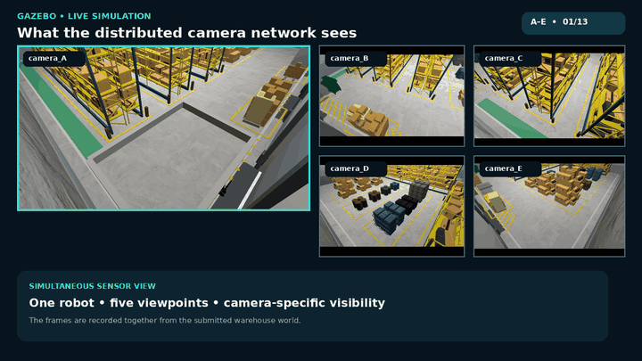
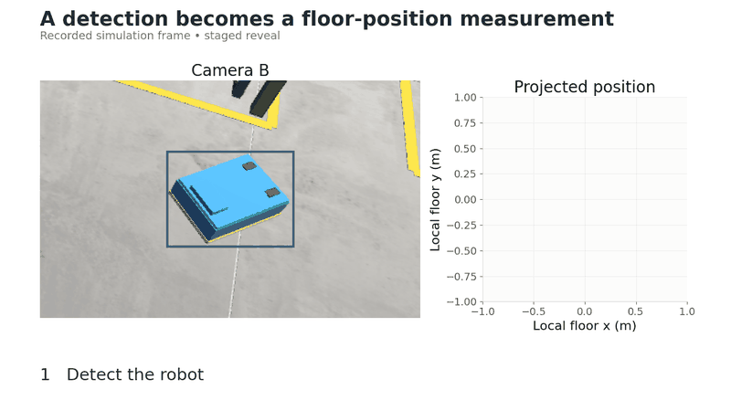
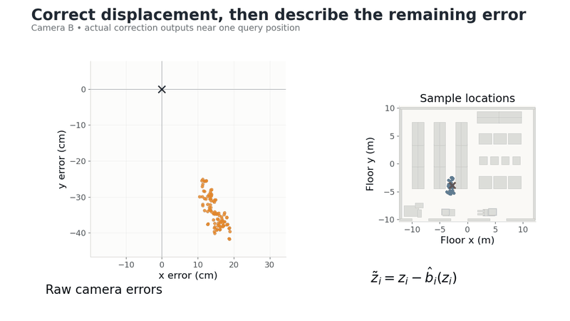
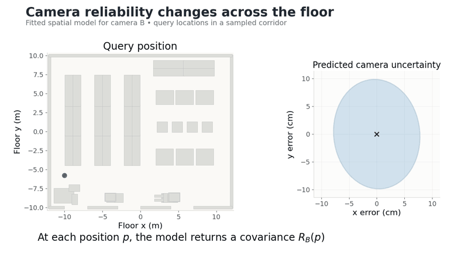
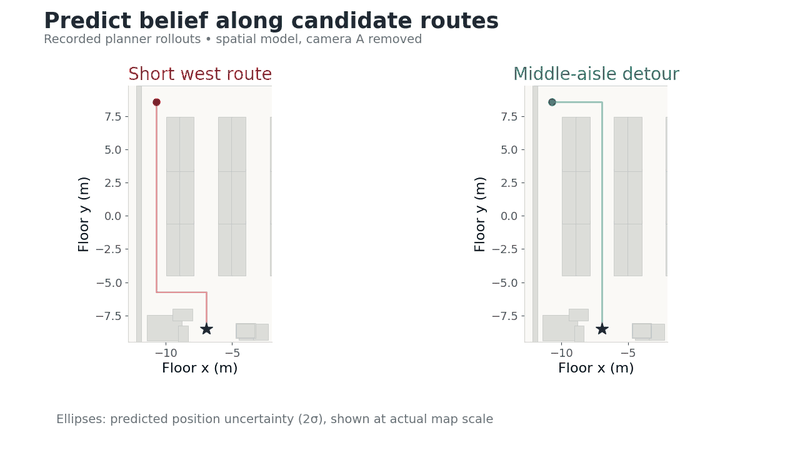
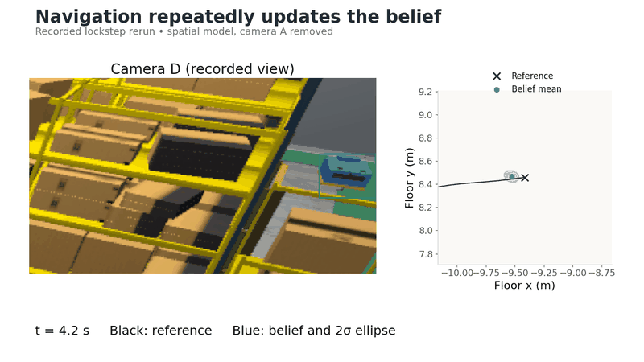
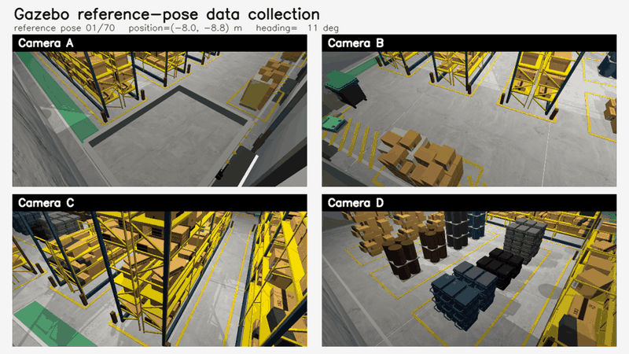
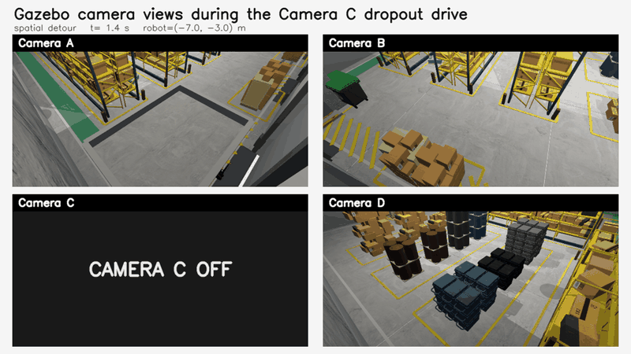
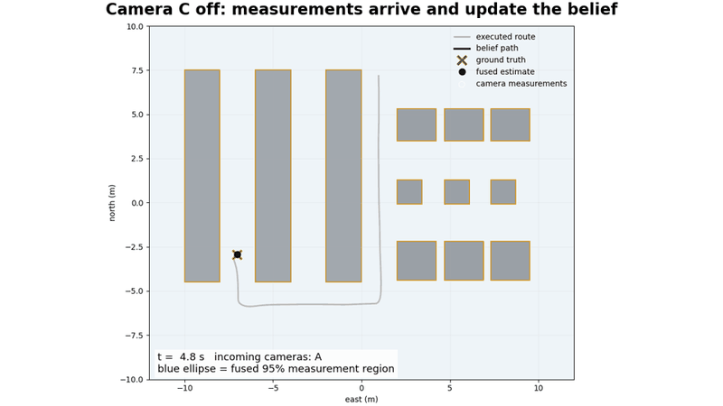
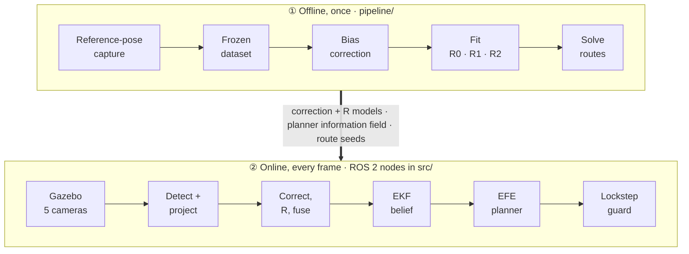

<div align="center">

# Camera-Network Modelling for Belief-Space Robot Navigation

**MSc thesis code · Joost Leliveld · Eindhoven University of Technology, 2026**




*Five fixed cameras watch one robot in a simulated warehouse. How much should
the robot trust each camera, and where?*

[**The idea**](#the-idea-in-five-pictures) ·
[**Code tour**](docs/CODE_TOUR.md) ·
[**Thesis → code**](docs/THESIS_TO_CODE.md) ·
[**Glossary**](docs/GLOSSARY.md) ·
[**Results**](#results) ·
[**Setup**](#setup) ·
[**Extending**](docs/EXTENDING.md)

</div>

---

## In one paragraph

A mobile robot drives through a known warehouse with wheel odometry and five
fixed ceiling cameras. A detector finds the robot in each image, and the
bottom of its box is projected onto the floor. That position is biased, and
how wrong it is depends on the camera and on where the robot stands. The code
learns a correction for the bias, fits a covariance `R` for what remains,
fuses the cameras with `R`, tracks the robot with an EKF, and plans routes
with an expected-free-energy objective that prefers places where the
cameras are reliable. The thesis compares three covariance models: one
global covariance (**R0**), one per camera (**R1**) and one per camera and
floor position (**R2**). Each is tested with all cameras working and with
one camera removed.

## The idea in five pictures

<table>
<tr>
<td width="50%" valign="top">

**1 · A detection becomes a floor position**



The bottom of the detected robot is intersected with the floor plane along
the camera ray.
→ [`src/perception`](src/perception)

</td>
<td width="50%" valign="top">

**2 · Learn the bias, then the remaining spread**



A small network removes the systematic offset (orange → blue). The covariance
of what is left becomes `R`.
→ [`pipeline/`](pipeline) · [`src/reliability`](src/reliability)

</td>
</tr>
<tr>
<td valign="top">

**3 · Camera reliability depends on position**



R2 gives a different covariance at every floor position. This is the model
the planner reads.
→ [`docs/METHOD.md`](docs/METHOD.md)

</td>
<td valign="top">

**4 · The planner predicts the belief along each route**



With camera A removed, the short route loses coverage. The detour stays where
the remaining cameras are reliable.
→ [`src/planning`](src/planning) · [`docs/PLANNER.md`](docs/PLANNER.md)

</td>
</tr>
<tr>
<td colspan="2" valign="top">

**5 · Closed loop: detect, fuse, update, drive**



A recorded drive. Black cross: ground-truth reference. Blue: EKF belief with
its 2σ ellipse.

</td>
</tr>
</table>

<details>
<summary><b>More recordings: data collection and a camera-dropout drive</b></summary>

<br>

**Reference-pose collection.** The robot is placed at surveyed poses while the
cameras record. These pairs are the training and evaluation data.



**Camera C switched off.** The cameras during the drive, and the belief and
fused measurements of the same task.





Sources for every animation: [`docs/media/README.md`](docs/media/README.md).

</details>

## How the pieces fit



The [code tour](docs/CODE_TOUR.md) follows one camera frame through this loop
file by file.

## Results

Final campaign: 5 tasks × 3 covariance models × 2 network states × 3 seeds =
**90 runs**, 15 per condition. These numbers are copied from
[`results/`](results/README.md), which is checksummed and needs no simulator.

| Covariance model | Cameras | Successful runs | Mean belief error (cm) |
| --- | --- | ---: | ---: |
| R0 · global | all | 14/15 | 6.81 |
| R0 · global | one removed | 11/15 | 15.86 |
| R1 · per camera | all | 14/15 | 4.49 |
| R1 · per camera | one removed | 7/15 | 20.01 |
| **R2 · spatial** | all | **15/15** | **3.14** |
| **R2 · spatial** | one removed | **15/15** | **3.10** |

The held-out audits (correction RMSE, fusion RMSE) use a different evaluation
population; see [`results/README.md`](results/README.md).

## Where to start

| I want to… | Go to |
| --- | --- |
| understand the method without code | [`docs/METHOD.md`](docs/METHOD.md), then [`docs/GLOSSARY.md`](docs/GLOSSARY.md) |
| see which file implements a thesis section or figure | [`docs/THESIS_TO_CODE.md`](docs/THESIS_TO_CODE.md) |
| follow the code from camera image to wheel command | [`docs/CODE_TOUR.md`](docs/CODE_TOUR.md) |
| check the thesis numbers | [`results/`](results/README.md) |
| run the tests | [Setup](#setup), then [Tests](#tests) |
| refit the models or rerun the campaign | [`docs/REPRODUCING.md`](docs/REPRODUCING.md) and [`docs/DATA.md`](docs/DATA.md) |
| add a camera, change the warehouse or the planner | [`docs/EXTENDING.md`](docs/EXTENDING.md) |

## Repository layout

```text
config/      Sensor-admission configuration
docs/        Method, planner, process noise, code tour, glossary, data and reproduction guides
  media/     Animations used in this README, with sources
figures/     One generator per thesis figure or table
pipeline/    Capture, dataset lock, fitting, audits, route solving, campaign and analysis
results/     Frozen aggregate thesis results and their checksums
src/         ROS 2 packages (each with a README) and the Gazebo world
tests/       Unit and integration tests, laid out like src/ and pipeline/
world/       Warehouse geometry and route utilities shared by pipeline and figures
```

## Setup

Use **Ubuntu 22.04, Python 3.10, ROS 2 Humble and Gazebo Fortress**. Follow the
[ROS 2 Humble installation guide](https://docs.ros.org/en/humble/Installation/Ubuntu-Install-Debs.html)
and [initialise rosdep](https://docs.ros.org/en/humble/Tutorials/Intermediate/Rosdep.html)
before running the commands below. The campaign templates use CUDA device `0`:
a compatible NVIDIA GPU/driver and a CUDA-enabled PyTorch build are needed for
the configured campaign. The unit tests and recorded-result analysis do not
run Gazebo. Offline detector inference can also use CPU.

```bash
git clone https://github.com/JoostLeliveld/msc-thesis-camera-network-navigation.git
cd msc-thesis-camera-network-navigation
sudo apt-get install python3-venv python3-colcon-common-extensions python3-rosdep \
  ros-humble-ros-gz ros-humble-cv-bridge curl unzip zstd
source /opt/ros/humble/setup.bash
rosdep install --from-paths src --ignore-src --rosdistro humble -r -y

# The system packages expose Humble's Python bindings to this environment.
python3 -m venv --system-site-packages .venv
source .venv/bin/activate
python3 -m pip install -r requirements-dev.txt -c requirements-lock.txt
python3 -m pip check
```

The NumPy/OpenCV bounds keep the environment on NumPy 1.x for Humble's compiled
Python bindings. See [ENVIRONMENT.md](docs/ENVIRONMENT.md) for the review
machine's versions. `requirements-lock.txt` pins the resolved Linux/Python 3.10
dependency set; `requirements.txt` and `requirements-dev.txt` declare the
supported ranges.

For simulation, fetch third-party assets and build the ROS packages:

```bash
bash src/sim/fetch_external_models.sh
python3 -m colcon build --symlink-install --base-paths src
source install/setup.bash
python3 -c "import torch; print('CUDA available:', torch.cuda.is_available())"
```

Use `--base-paths src`: archived logs contain source snapshots that must not be
rediscovered as ROS packages. Run commands from the repository root.

## Tests

```bash
python3 -m pytest -q
```

Tests that need recorded data, fetched simulator assets or unavailable ROS
components are skipped when those inputs are absent. Passing code-only tests is
not a simulation rerun. Use a Git clone rather than a ZIP download, because the
path-portability check reads the Git file inventory.

## Data

The code and aggregate results are public. Camera images, trained weights and
full run logs are available from the author on request; see
[`docs/DATA.md`](docs/DATA.md). A code-only clone runs the tests and the
results checks, but cannot retrain or rerun navigation.

## Reproducing results

The [reproduction guide](docs/REPRODUCING.md) gives ordered commands for
reanalysing the recorded evidence and for refitting and running a new campaign,
with expected outputs, hardware needs and recovery steps.
`bash figures/regenerate.sh` regenerates every figure once the evidence is in
place. [VERIFICATION.md](docs/VERIFICATION.md) lists the checks run on this
release.

## Citation and contact

Use GitHub's **Cite this repository** entry or [CITATION.cff](CITATION.cff).
Record `git rev-parse HEAD` when reporting a rerun. For the data bundles,
contact Joost Leliveld at
[j.j.p.leliveld@student.tue.nl](mailto:j.j.p.leliveld@student.tue.nl).

The [IWAI 2026 code](https://github.com/JoostLeliveld/iwai2026-camera-reliability-efe)
reports a separate, earlier experiment and is not the implementation of this
thesis.

## Licence

Original code is MIT-licensed. ROS packages declaring Apache-2.0 keep that
licence. Third-party assets and dependencies keep their own terms; see
[LICENSES/README.md](LICENSES/README.md).
