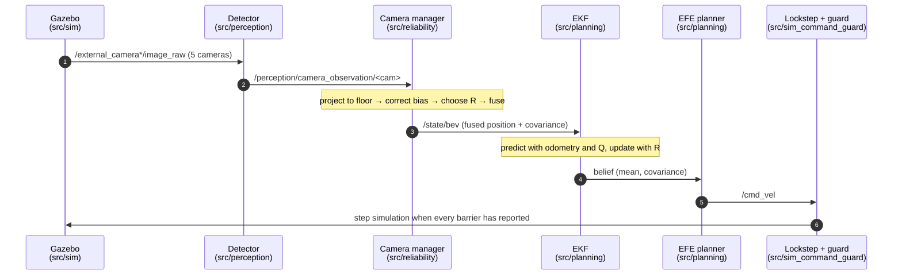
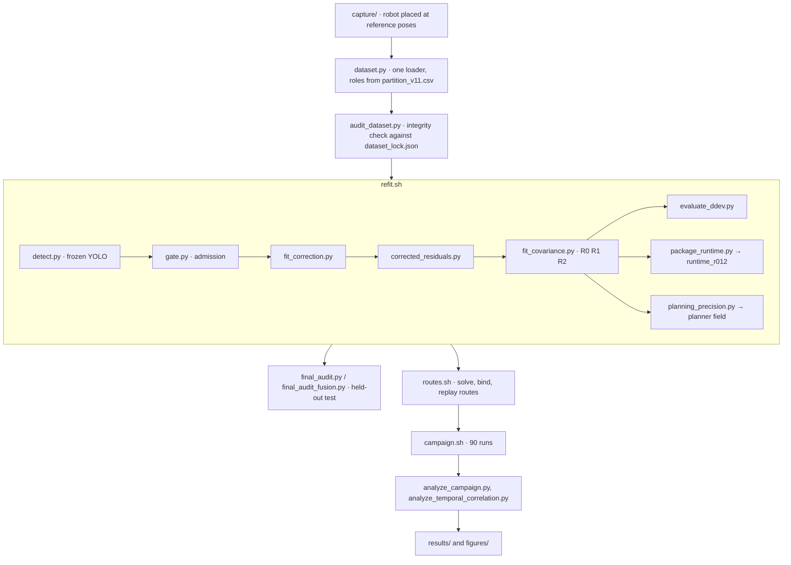

# Code tour: one camera frame, start to finish

This tour follows a single camera frame from the Gazebo renderer to a wheel
command, then shows where the offline models it uses come from. Each step names
the file and function to open. Search for the function name rather than relying
on line numbers.

## 0 · The launch file that starts everything

| | |
| --- | --- |
| Launch file | [`src/experiments/launch/warehouse_primary_comparison.launch.py`](../src/experiments/launch/warehouse_primary_comparison.launch.py) |
| Node graph | [`src/experiments/experiments/core/visibility_launch_common.py`](../src/experiments/experiments/core/visibility_launch_common.py): `build_shared_nodes`, `_multicam_perception_nodes`, `build_agent_runtime_actions` |
| Campaign settings | [`pipeline/execution_template.yaml`](../pipeline/execution_template.yaml) (sets `launch_file`, `multicam_belief: true`, `manager_covariance_profile`, `manager_observation_model`) |

Useful arguments: `planner`, `task`, `seed`, `world`, `multicam_belief`,
`manager_covariance_profile`, `manager_observation_model`, `horizon`, `dt`,
`v_max`, `process_noise_model`, `lockstep`, `headless`. Every argument has a
`description` in the launch file.

## 1 · Gazebo renders the cameras

- World: [`src/sim/gazebo_worlds/worlds/warehouse_v2.world.sdf`](../src/sim/gazebo_worlds/worlds/warehouse_v2.world.sdf) includes `external_camera` and `external_camera_b` … `_e`, each 5 m above the floor.
- Camera models: `src/sim/models/external_camera*/model.sdf` (resolution, field of view, topic).
- ROS bridge: [`src/sim/launch/bringup_sim.launch.py`](../src/sim/launch/bringup_sim.launch.py).
- **Out:** `/external_camera/image_raw`, `/external_camera_{b,c,d,e}/image_raw`.

## 2 · The detector finds the robot

[`src/perception/perception/nodes/batched_four_camera_yolo_node.py`](../src/perception/perception/nodes/batched_four_camera_yolo_node.py),
class `BatchedFourCameraYoloNode`. The name is historical: it handles all five
cameras (`camera_A` … `camera_E`).

1. `_image_callback` collects one frame per camera with the same capture stamp.
2. `_process_batch` → `_predict_batch` runs one YOLO forward pass over the whole batch.
3. `_prepare_result` takes the bottom edge of the robot mask as the image point, with the box bottom as fallback.
4. `_publish_camera` publishes the result.

**Out:** `/perception/camera_observation/<cam>` (JSON, read by the camera
manager) and `/perception/camera_batch_outcome` (read by the lockstep
scheduler).

## 3 · Project the image point onto the floor

[`src/reliability/reliability/projection.py`](../src/reliability/reliability/projection.py):
`camera_model_from_world` builds each camera from the world SDF;
`project_observation_to_world` intersects the pixel ray with the floor plane.
The camera manager calls it from `_map_observations` in
[`camera_manager_node.py`](../src/reliability/reliability/nodes/camera_manager_node.py).

## 4 · Remove the systematic bias

Still inside `CameraManagerNode._map_observations`. The branch is chosen by
`observation_model`; the campaign uses `visibility_patch`:

- [`src/reliability/reliability/commissioned_visibility.py`](../src/reliability/reliability/commissioned_visibility.py),
  class `CommissionedVisibilitySensorModel`: `correction_ray` predicts the
  along-ray and across-ray offset; `correct_and_covariance` returns the
  corrected position together with `R`.
- The network weights and metadata are produced offline by
  [`pipeline/fit_correction.py`](../pipeline/fit_correction.py) and packaged by
  [`pipeline/package_runtime.py`](../pipeline/package_runtime.py).

## 5 · Choose the covariance R

`CommissionedVisibilitySensorModel._ray_r_covariance` switches on
`runtime_covariance_model`:

| Value | Model | Meaning |
| --- | --- | --- |
| `R0_global_full` | R0 | one covariance for every camera and position |
| `R1_per_camera_full` | R1 | one covariance per camera |
| `R2_spatial_residual` | R2 | per camera, from the 16 nearest fitted positions (`_spatial_covariance`) |

R is built in the camera's ray frame (along and across the viewing ray) and
rotated into world coordinates. The R0/R1/R2 choice comes from the packaged
runtime model, not from a launch argument.

## 6 · Fuse the cameras

`CameraManagerNode._decide_once` → `_decide_fused`:

1. `_synchronous_fusion_candidates` keeps views from the same detector round
   (timestamp spread below `fusion_max_timestamp_spread_s`).
2. `_gated_fusion` applies the disagreement gate.
3. [`fusion.py`](../src/reliability/reliability/fusion.py)
   `independent_measurement_fusion_2d` does inverse-covariance weighting:
   `P = (Σ Rᵢ⁻¹)⁻¹`, `x = P Σ Rᵢ⁻¹ zᵢ`.

**Out:** `/state/bev` (fused position with covariance) and
`/reliability/camera_manager/batch_outcome` (for the lockstep scheduler).

## 7 · EKF: predict with odometry, update with the cameras

Base class [`src/planning/planning/nodes/unicycle_planner_node.py`](../src/planning/planning/nodes/unicycle_planner_node.py)
(`UnicyclePlannerNode`); the running node is `EfeAgentNode` in
[`efe_agent_node.py`](../src/planning/planning/nodes/efe_agent_node.py).

- **Predict:** `_odom_cb` on `/odom_noisy` → `_run_motion_replay` →
  `UnicyclePlannerBase.predict` in
  [`planners/base_planner.py`](../src/planning/planning/planners/base_planner.py).
  Process noise Q comes from `unicycle_process_noise` in
  [`core/dynamics.py`](../src/planning/planning/core/dynamics.py) and
  `encoder_psd` in [`core/encoder_noise_model.py`](../src/planning/planning/core/encoder_noise_model.py).
  See [`PROCESS_NOISE.md`](PROCESS_NOISE.md).
- **Update:** `/state/bev` → `_state_cb` → `_apply_state_correction` →
  `apply_correction` in [`core/belief_correction.py`](../src/planning/planning/core/belief_correction.py)
  (`compute_update` is the Joseph-form Kalman update; `normalized_innovation_squared`
  is the NIS gate).

## 8 · Plan a route with expected free energy

| What | Where |
| --- | --- |
| Risk term (KL divergence to the goal prior) | `risk_ca` in [`core/casadi_efe.py`](../src/planning/planning/core/casadi_efe.py) |
| Ambiguity term (expected posterior uncertainty) | `ambiguity_ca`, `expected_posterior_uncertainty_ca` |
| Objective over the camera network | `make_metric_network_efe_valgrad_fn` |
| Camera information field the planner reads | `CameraNetworkModel` in [`core/camera_network.py`](../src/planning/planning/core/camera_network.py) |
| Optimiser | `UnicyclePlannerBase.plan`: CasADi gives value and gradient, `scipy.optimize.minimize(method='L-BFGS-B')` optimises |
| Route seeds through the aisles | `generate_route_seeds` in [`src/unav_common/unav_common/lane_graph_routes.py`](../src/unav_common/unav_common/lane_graph_routes.py) |
| Planning loop | `EfeAgentNode._plan_once_impl` |

The objective and its constants are described in [`PLANNER.md`](PLANNER.md).

## 9 · Send the command; step the simulation

- `EfeAgentNode._publish_command` publishes `/cmd_vel`; `_ff_fb_plan` is the
  feed-forward/feedback tracker.
- [`src/sim_command_guard/src/command_guard_system.cc`](../src/sim_command_guard/src/command_guard_system.cc):
  a Gazebo plugin that applies the command and drops stale ones.
- [`src/sim_command_guard/src/lockstep_scheduler.cc`](../src/sim_command_guard/src/lockstep_scheduler.cc):
  with `lockstep:=true`, Gazebo stays paused and is stepped only after the
  detector, camera manager, odometry and planner have all reported for the
  current step. Simulated time therefore never runs ahead of a slow detector.

---

## Where the runtime models come from (offline)

The exact commands, inputs and outputs are in [`REPRODUCING.md`](REPRODUCING.md).

## Packages at a glance

| Package | Role |
| --- | --- |
| [`sim`](../src/sim) | Warehouse world, camera and robot models, bringup launch, noise and clock helpers |
| [`sim_command_guard`](../src/sim_command_guard) | C++ Gazebo plugin for commands, and the lockstep scheduler |
| [`perception`](../src/perception) | YOLO robot detectors that publish image-point observations |
| [`reliability`](../src/reliability) | Projection, bias correction, R, fusion and the camera-manager node; mostly ROS-independent |
| [`state`](../src/state) | Single-camera pixel-to-state adapter (used only with `multicam_belief:=false`) |
| [`planning`](../src/planning) | EKF belief, EFE objective, optimiser, `efe_agent` node |
| [`experiments`](../src/experiments) | Comparison launch file, world and task profiles, goal mission, experiment logger |
| [`unav_common`](../src/unav_common) | Shared helpers: lane-graph route seeds, camera model, navigation parameters |

## Tips for reading the code

- Start with the tests. `tests/` mirrors `src/` and `pipeline/`, and most tests
  run without ROS or data, so they are the quickest way to see a function used.
- `D_dev` in code is the thesis validation set `D_val`. See [`GLOSSARY.md`](GLOSSARY.md).
- Parameters marked `DIAGNOSTIC ONLY` are not used in campaign runs; the
  campaign runner refuses `use_diagnostic_odom_localization`.
- The `reliability` package also contains modules from earlier experiments
  that the thesis runtime does not import; follow the imports from
  `camera_manager_node.py` to see what is live.
